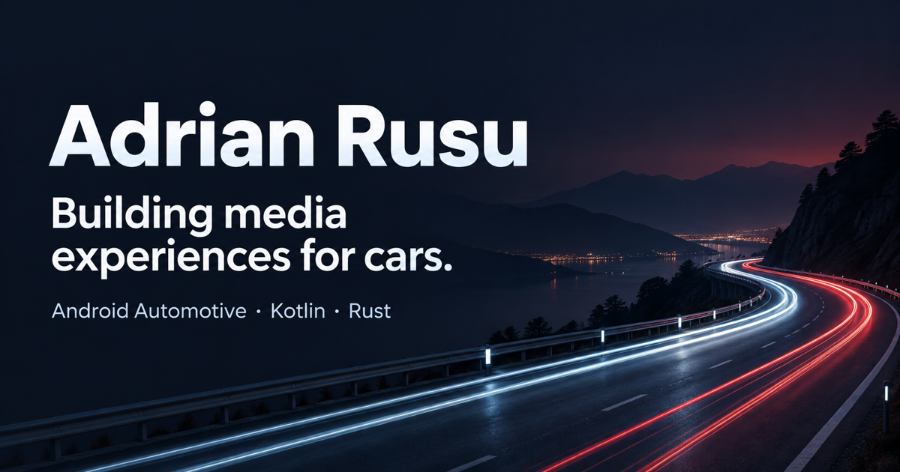
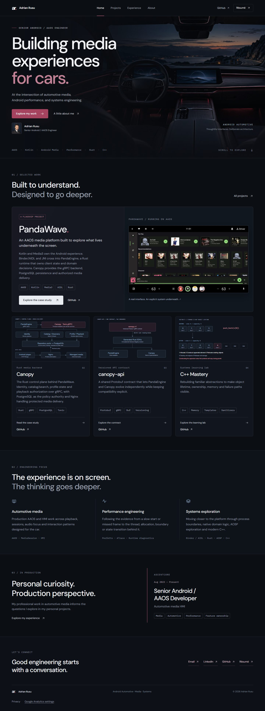
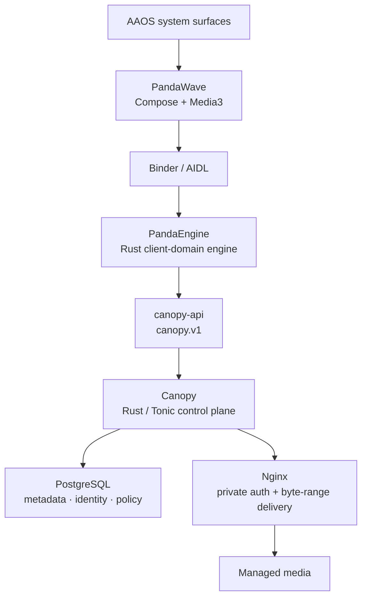

<div align="center">


# Adrian Rusu — Engineering Portfolio

**Senior Android / AAOS engineer building automotive media experiences and exploring the systems underneath them.**

[](https://adrianrusu.dev)
[](https://github.com/adrianrusu16/adrian-rusu-portfolio/actions/workflows/ci.yml)


[Portfolio](https://adrianrusu.dev) ·
[LinkedIn](https://www.linkedin.com/in/adrian-leontin-rusu/) ·
[GitHub](https://github.com/adrianrusu16) ·
[Email](mailto:hello@adrianrusu.dev)

</div>

---

## Overview

This repository is the source for **[adrianrusu.dev](https://adrianrusu.dev)** — a static engineering portfolio focused on:

- production **Android Automotive OS (AAOS)** media / HMI engineering;
- Android performance, diagnostics and automotive interaction;
- explicit **Binder/AIDL**, JNI/FFI and gRPC boundaries;
- Rust client-domain and backend systems work;
- modern C/C++ systems-programming practice.

The site is intentionally evidence-first: real PandaWave screenshots, repo-backed architecture diagrams, direct source links, constrained technical claims and explicit separation between public personal projects and proprietary commercial work.

<p align="center">
  
</p>

<details>
<summary><strong>Full homepage preview</strong></summary>
<br />



</details>

## Featured work

| Project         | Focus                                                                                  | Source                                                                  |
| --------------- | -------------------------------------------------------------------------------------- | ----------------------------------------------------------------------- |
| **PandaWave**   | AAOS media platform: Compose, Media3, Binder/AIDL, JNI/FFI, Rust domain engine         | [adrianrusu16/PandaWave](https://github.com/adrianrusu16/PandaWave)     |
| **Canopy**      | Rust/Tonic control plane: identity, catalog/search, playback policy, PostgreSQL, Nginx | [adrianrusu16/Canopy](https://github.com/adrianrusu16/Canopy)           |
| **canopy-api**  | Versioned `canopy.v1` Protobuf/gRPC contract, Buf compatibility discipline             | [adrianrusu16/canopy-api](https://github.com/adrianrusu16/canopy-api)   |
| **C++ Mastery** | Lifetime, RAII, allocators, templates, custom containers and sanitizer-backed labs     | [adrianrusu16/cpp-mastery](https://github.com/adrianrusu16/cpp-mastery) |

### Ecosystem shape



> **Android presents state. Rust owns client-side domain decisions. Canopy owns backend policy. Media bytes stay outside the gRPC control plane.**

## Site architecture

The portfolio is intentionally small and static:

- **Astro 5 + MDX** for statically rendered pages and case studies;
- **TypeScript** for typed site/content data;
- minimal client JavaScript for navigation, case-study TOC state and the screenshot lightbox;
- responsive real project screenshots;
- SVG architecture diagrams;
- one shared identity source for domain, email, LinkedIn, GitHub and résumé links.

```text
src/
├── components/        reusable UI, evidence cards, diagrams, galleries
├── content/projects/  PandaWave, Canopy, canopy-api, C++ case studies
├── data/              identity + image metadata
├── layouts/           metadata, navigation, JSON-LD, contact footer
├── pages/             route entry points, sitemap and robots
└── styles/            shared visual system

public/
├── images/            screenshots, architecture, portrait, social cards
└── adrian-rusu-resume.pdf
```

## SEO & answer-engine discoverability

The site includes conventional SEO and machine-readable identity/project context rather than keyword stuffing:

- canonical URLs on `https://adrianrusu.dev`;
- per-page titles and descriptions;
- OpenGraph and Twitter metadata;
- XML sitemap + crawlable `robots.txt`;
- `Person`, `WebSite`, `WebPage`, `ProfilePage`, `CollectionPage`, `ItemList`, `TechArticle`, `SoftwareSourceCode` and breadcrumb structured data where appropriate;
- `sameAs` identity links to LinkedIn and GitHub;
- public project/source URLs close to the technical claims they support;
- `OAI-SearchBot` crawl access;
- project descriptions and schema generated from the typed Markdown collection;
- an explicitly non-indexable 404 page.

Search/AEO measurement should happen from real production data after launch — primarily Search Console, PageSpeed/CrUX and, optionally, read-only SEOMonster workflows.

## Performance strategy

The site is statically rendered and intentionally light on client-side work.

- homepage cockpit artwork is preloaded as the likely LCP candidate;
- above-the-fold identity/project imagery is prioritized;
- secondary project images and architecture diagrams use native lazy loading;
- screenshots use `decoding="async"` and responsive `srcset` where available;
- the full lightbox asset is not assigned a `src` until opened;
- Google Fonts use explicit preconnect + stylesheet loading rather than CSS `@import`.

Performance claims are measured only when a reproducible workload and trace exist; the portfolio does not invent benchmark numbers.

## Development

### Requirements

- **Node.js 24**
- **pnpm 11.25.0**

```bash
pnpm install --frozen-lockfile
pnpm dev
```

Local development runs on the host/port configured in `package.json`.

### Quality gates

```bash
pnpm check
pnpm lint
pnpm format:check
pnpm build
pnpm test
```

GitHub Actions runs the same validation on pushes and pull requests.

The test suite checks, among other things:

- expected static routes;
- unique page metadata and IDs;
- internal links / anchors;
- public project source links;
- image and résumé assets;
- social metadata;
- sitemap / crawler files;
- structured-data invariants.

Browser-level interaction and accessibility validation remains a separate follow-up; the repository does not claim automated Playwright/Lighthouse coverage that it does not run.

## Content provenance

Case-study claims are intentionally grounded in public source where possible.

- PandaWave implementation evidence → [`PandaWave`](https://github.com/adrianrusu16/PandaWave)
- Canopy implementation evidence → [`Canopy`](https://github.com/adrianrusu16/Canopy)
- API-contract evidence → [`canopy-api`](https://github.com/adrianrusu16/canopy-api)
- C++ learning-lab evidence → [`cpp-mastery`](https://github.com/adrianrusu16/cpp-mastery)

Commercial client work performed through AscentCore is described only through responsibilities, tools and areas of practice. Client identities, proprietary screenshots, code, traces and internal architecture are not disclosed.

The portrait is an identity-preserving edit of a supplied photograph. PandaWave UI images are real project captures. Architecture graphics are explanatory figures, not measured benchmark output.

## Deployment

Current production path:

```text
GitHub `main`
      ↓
reviewed source archive / release
      ↓
ChatGPT Sites
      ↓
adrianrusu.dev
```

**GitHub `main` is the canonical source of truth.** ChatGPT Sites is the current host/deployment surface, not the authoritative development copy.

For every production change:

1. make/update the source in Git;
2. pass CI;
3. merge to `main`;
4. deploy the exact `main` revision to the existing ChatGPT Site;
5. preview;
6. publish only after approval.

If a future Sites edit changes source directly, export that result and reconcile it back into Git **before the next change**. This prevents the Site's internal working copy and GitHub from drifting.

The domain is intentionally host-independent. A future migration to Cloudflare Pages, Vercel or GitHub Pages should require only deployment/DNS changes; public links remain `adrianrusu.dev`.

## Source export

```bash
python scripts/export-source.py
```

This generates a portable source archive while excluding credentials, `.sites-runtime`, dependencies and build output.

## GitHub social preview

The repository includes:

```text
docs/images/readme/github-social-preview.png
```

Upload that image manually under:

**Repository → Settings → Social preview → Edit → Upload an image**

GitHub currently recommends **1280×640** for best rendering; this asset is prepared at that size.

## Rights

This repository is public for portfolio review and engineering evidence.

No public software license is granted by default. Personal copy, portrait, third-party album imagery visible in screenshots, and generated/edited visual assets are not implicitly licensed for reuse. Add an explicit code license later only if reuse is intended.
